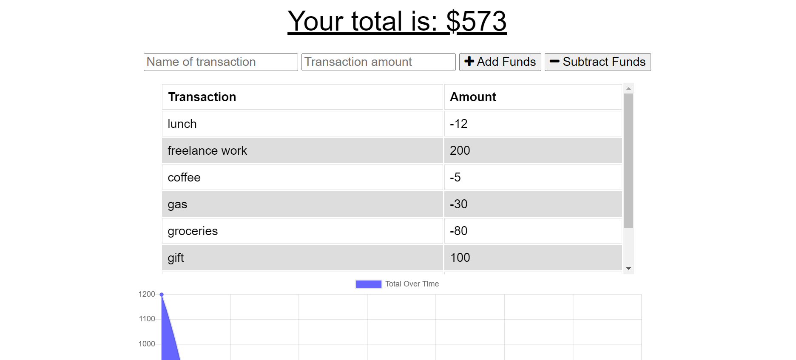
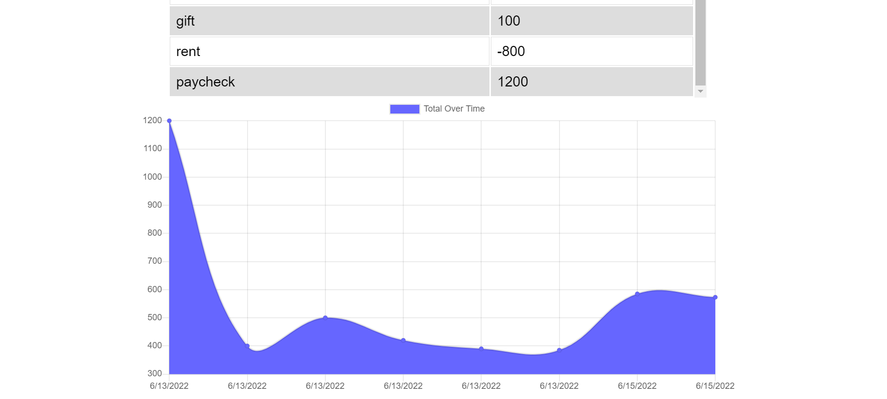

  # Budget Tracker
  

  ## Description
  This application is a budget tracking app that has been updated to have offline functionality. Users can enter their money transactions into the form and their total, list of transactions, and chart of the total over time are updated. The database storing a user's transactions is also updated while the app is online. A service worker has been included in order to locally cache files relavent to the app's basic funcionality. Data saved on the app while offline is temporarily stored locally in IndexedDB and is transferred to the database when the app is back online. Also, a mainfest.json file was added in order to convert this app to a Progressive Web Application, or PWA. PWAs are increasing in popularity and it is important to understand how these functional pieces work together to create a good user experience offline.

  ## Screenshots
  
  

  ## Table of Contents
  * [Usage](#usage)
  * [License](#license)
  * [Questions](#questions)

  ## Usage
  This app can be found at [https://salty-waters-55531.herokuapp.com/](https://salty-waters-55531.herokuapp.com/)

  ## License
  
    Copyright 2022 by emilyk221.

    Licensed under the MIT license.
    Permission is hereby granted, free of charge, to any person obtaining a copy of this software and associated documentation files (the "Software"), to deal in the Software without restriction, including without limitation the rights to use, copy, modify, merge, publish, distribute, sublicense, and/or sell copies of the Software, and to permit persons to whom the Software is furnished to do so, subject to the following conditions:
    The above copyright notice and this permission notice shall be included in all copies or substantial portions of the Software.
    
  [https://opensource.org/licenses/MIT](https://opensource.org/licenses/MIT)

  ## Questions
  Please visit my GitHub profile [here](https://github.com/emilyk221) for more information about this and other projects.
  